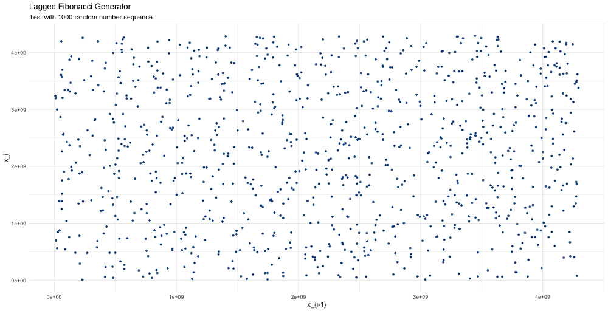
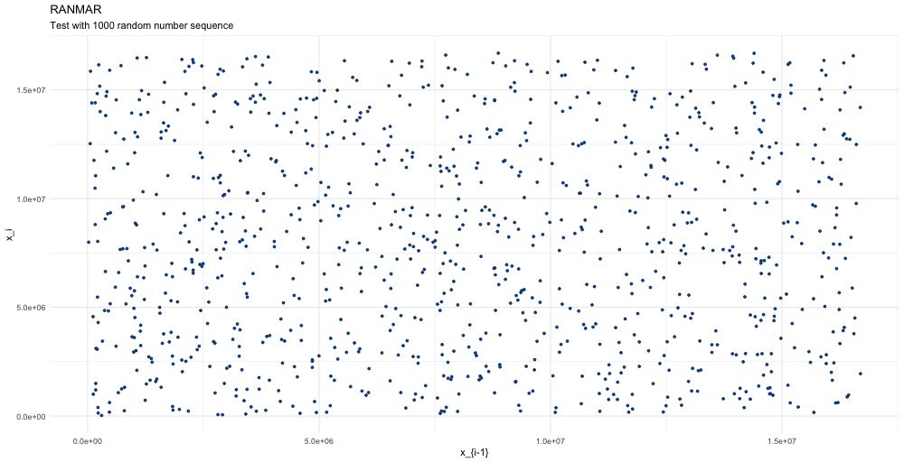

# NumericalAlgorithms.jl


[](https://codecov.io/gh/mrtkp9993/NumericalAlgorithms.jl)
[](https://github.com/mrtkp9993/NumericalAlgorithms.jl/blob/main/LICENSE)

Numerical algorithms implemented in Julia.

## Installation

Install the package with ```add https://github.com/mrtkp9993/NumericalAlgorithms.jl``` in package mode (```]```).

## Algorithms

Currently implemented:

* Root finding algorithms
    * [Secant method](https://github.com/mrtkp9993/NumericalAlgorithms.jl/blob/038b17319fbaec8133631e59c13e99ad6787af3f/src/RootFinding.jl#L3) 
    * [Broyden's method](https://github.com/mrtkp9993/NumericalAlgorithms.jl/blob/038b17319fbaec8133631e59c13e99ad6787af3f/src/RootFinding.jl#L19)
* Differentation
    * [Automatic differentiation via dual numbers](https://github.com/mrtkp9993/NumericalAlgorithms.jl/blob/0e8b9d5150a734a67033548762a57e26f9725fe3/src/Differentiation.jl#L1)
* Integration
   * [Composite Simpson - One dim.](https://github.com/mrtkp9993/NumericalAlgorithms.jl/blob/59ab2397869ecf563e8d3c41aeccc1210c2f3d1e/src/Integration.jl#L12)
   * [Double Simpson - Two dim.](https://github.com/mrtkp9993/NumericalAlgorithms.jl/blob/59ab2397869ecf563e8d3c41aeccc1210c2f3d1e/src/Integration.jl#L46)
   * [WIP] [Monte Carlo Integration]()
* Random Number Generators (RNGs)
    * Pseudo-random numbers
        * [Lagged Fibonacci generator](https://github.com/mrtkp9993/NumericalAlgorithms.jl/blob/279a50635734098c8a72f3c3ca79393a69be4900/src/Random.jl#L3)
        * [RANMAR](https://github.com/mrtkp9993/NumericalAlgorithms.jl/blob/5d7a65acb540707fdd48adc60cf705841ae08efa/src/Random.jl#L32)
    * [WIP] Quasi-random numbers
* Statistical Tests
    * [Wald–Wolfowitz runs test](https://github.com/mrtkp9993/NumericalAlgorithms.jl/blob/9fe1ddeb3e6d17b9ef461a9142731296ee559a67/src/StatisticalTests.jl#L3)

*Todo*
* Optimization
* Stochastic process & SDEs
* ...
* More comments & self-commenting code

## Visual tests for RNGs





## License

Distributed under the GPL License. See ```LICENSE``` for more information.

## Contact

Murat Koptur, [LinkedIn](https://www.linkedin.com/in/muratkoptur/)

Email: [muratkoptur@yandex.com](mailto:muratkoptur@yandex.com?subject=NumericalAlgorithms.jl)

## References

* Press, William H., Teukolsky, S. A., Vetterling, W. T., & Flannery, B. P. (2007). Numerical Recipes 3rd Edition: The Art of Scientific Computing (3rd ed.). Cambridge, England: Cambridge University Press.
* Kochenderfer, M. J., & Wheeler, T. A. (2019). Algorithms for Optimization (The MIT Press) (Illustrated ed.). The MIT Press.
* Burden, R. L., & Faires, D. J. (2010). Numerical Analysis (9th ed.). Cengage Learning.
* Zwillinger, D. (2018). CRC Standard Mathematical Tables and Formulas, 33rd Edition. Amsterdam University Press.
* Stoop, R., Hardy, A., Hardy, Y., & Steeb, W. (2004). Problems and Solutions in Scientific Computing with C++ and Java Simulations. World Scientific Publishing Company.
* Weinzierl, S. (2000, June 23). Introduction to Monte Carlo methods. ArXiv.Org. https://arxiv.org/abs/hep-ph/0006269.
* Lists of small primes. (2020). The PrimePages: Prime Number Research & Records. https://primes.utm.edu/lists/small/.
